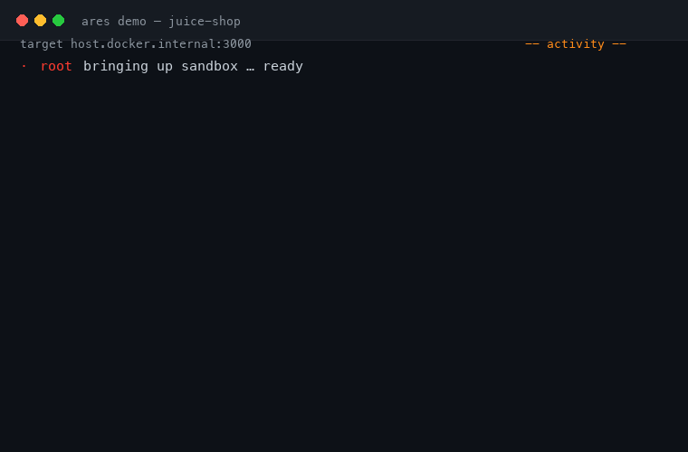

<div align="center">

# Arès

**A local-first, verifiable, autonomous AI pentester.**

Runs entirely on your machine. Signs every report. Tells you when it can't be trusted.



[](LICENSE)
[]()
[]()
[](https://github.com/usestrix/strix)

</div>

---

Arès is a hard-fork of [**Strix**](https://github.com/usestrix/strix) — the open-source multi-agent AI pentester by OmniSecure. Strix supplies the engine: a swarm of agents that do recon, exploit, and validate vulnerabilities on a target. Arès rebuilds the layer *around* it that a real engagement needs — **privacy, trust, and reliability**.

```bash
ares demo      # 45-second showcase — no LLM, no cloud, no setup
```

## Why Arès, not just Strix

Strix is an excellent engine, but it is cloud-first and it trusts whatever the model produces. Arès closes both gaps.

| | Strix | **Arès** |
|---|:---:|:---:|
| Runs fully local / offline | via config | **guided, first-class** |
| Data leaves your machine | yes (cloud + telemetry) | **no — telemetry off by default** |
| Signed, verifiable reports | — | **Ed25519, tamper-evident** |
| Knows when a run is unreliable | — | **confidence gate (🟢/🔴)** |
| Vets a model before wasting a scan | — | **model-eval (STRIX-READY)** |
| One model for everything | yes | **cascade — fast triage, strong validation** |
| Scope guardrails + kill-switch | partial | **allowlist, SSRF block, kill-switch** |

## The honest pitch

Arès is **local-first: private, offline, no API cost.** That is the point — and the trade-off is real:

- Local models are for **privacy**, not maximum precision. A small model can answer a security question well yet miss or hallucinate a finding when driving an autonomous agent loop.
- So Arès doesn't ask you to trust the model. It **grades every run** (a 🔴 LOW verdict means "re-run stronger", not "the target is clean"), **signs every report** (authenticity never rests on trust), and can **escalate the hard calls to a frontier model** — locally by default, cloud only if you opt in.

Reliability over raw power.

## Quickstart

```bash
# 1. clone and install (Python 3.12) — vendored engine + the `ares` command
git clone https://github.com/nuisant/ares && cd ares
pip install -e ".[engine]"          # or: uv pip install -e ".[engine]"

# 2. set up a local model, guided — detects your hardware, picks & pulls a model
#    (needs Ollama + Docker running)
ares init

# 3. see everything at a glance
ares                                # interactive hub
ares dashboard                      # hardware + local model catalog

# 4. or just watch it work end to end (no LLM, no cloud)
ares demo
```

> Requires Python 3.12+, [Ollama](https://ollama.com), and Docker.

## The toolkit — one entry point

Run `ares` for the hub, or call any tool directly:

| Command | What it does |
|---|---|
| `ares init` | guided local-LLM setup (hardware → model → config) |
| `ares dashboard` | hardware + model catalog, with STRIX-READY badges |
| `ares eval <model>` | live test — is this model usable as an agent? |
| `ares console` | streaming chat with the local engine |
| `ares demo` | 45-second scripted showcase of a full engagement |
| `ares watch` | live agent activity during a running scan |
| `ares verify <run>` | check a report's Ed25519 signature |

## How it works

**Model cascade.** Cheap breadth on a fast model, decisive calls on a strong one:

- **triage** → `Qwen3.5 (14B)` — recon, crawl, mapping
- **validate** → `Qwen3.6-27B-OBLITERATED` — confirmation, PoC, reporting
- **escalate** → a hosted frontier model, opt-in, off by default

Each agent is routed to the right tier by role. All local tiers share one endpoint; only the model name changes.

**Verifiable provenance.** Every run is signed with Ed25519 over a SHA-256 manifest of its artifacts. `ares verify` reports:

- `VERIFIED` — signature valid **and** signed by a pinned, trusted Arès key (authentic)
- `INTACT` — signature valid and nothing modified, but the key isn't pinned (integrity only)
- `FAILED` — content changed, a file dropped/added, or an untrusted re-sign

Tampering is always detectable; forging authenticity requires the private key.

**Confidence gate.** After a scan, Arès grades what the agents actually did — findings, tool actions, files read, give-up signals — and marks the run 🟢 HIGH / 🟡 OK / 🔴 LOW. A bailed, empty report can never pass as a real "clean".

## Architecture

```
ares_setup/        the Arès product — init, dashboard, cascade, guardrails,
                   model-eval, confidence, offline, diff, compliance, hub
ares_provenance/   Ed25519 signing & verification (zero external deps but crypto)
ares_console.py    streaming local console
ares_watch.py      live agent-activity feed + auto-sign on completion
ares_engine/       the vendored, modified Strix engine (owned, not patched)
```

The engine lives in `ares_engine/` — a full, version-controlled copy of Strix with the Arès modifications baked in (ethical-use notice, local-first routing, cascade, Docker naming, reliability fixes). See [`ares_engine/VENDORED.md`](ares_engine/VENDORED.md) for the exact diff vs upstream.

## Ethical use

Arès is for **authorized** security testing only — on systems you own or have explicit written permission to test. You alone are responsible for how you use it. The authors accept no liability for misuse.

## License & attribution

Arès is licensed under the **Apache License 2.0** ([`LICENSE`](LICENSE)).

It is a derivative work of **Strix** (© 2025 OmniSecure Inc., Apache-2.0). Modified files carry a notice per Apache-2.0 §4; see [`NOTICE`](NOTICE). The name "Strix" is used only to describe the origin of this work. Thanks to the Strix team for the engine.
